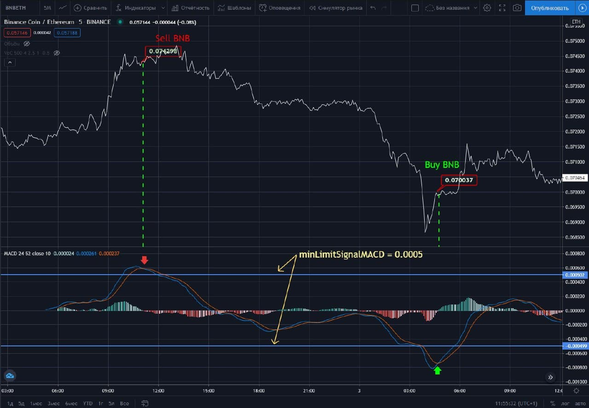

# _Binance exchange trade bot (master_bot)_

## About project

<b>Master_bot</b> trades using indicator MACD.  
Signal for the opening (close) of position - moving everege value crossing higher (below) selected minLimitSignalMACD.  
Also your complete orders will be saving in file 'log.txt'

.

## Tehnical stuff and packages

   <ul>
      <li>talib</li>
      <li>node-binance-api</li>
      <li>node-fetch</li>
      <li>node-telegram-bot-api</li>
   </ul>

## Install and start

<ol>
   <li>You need nodejs versin 12.4 or higher - <a href='https://nodejs.org/en/'>Node.js</a></li>
   <li>install node-modules - npm install</li>
   <li>SignIn in cryptoexchange <a href="https://www.binance.com/ru/register?ref=50017614">Binance</a></li>
   <li>Create  <a href="https://www.binance.com/ua/support/faq/360002502072-How-to-create-API">Api Key</a></li>
   <li>You need to save received keys in file '/src/modules/config/apiKey'</li>
   <li>if you want to get message in Telegram, when complite new order, you need add <a href="https://telegram.me/alarmer_bot">@alarmer_bot</a>, and send /key. Received key save in file '/src/modules/config/apiKey'</li>
   <li>And you need deposit ETH and BNB, 50% - 50%</li>
   <li>Now you can run Master_bot - open the folder '/src', open terminal, and run comand 'node index.js'</li>
</ol>

## Tests

You can run test bot, if you want to check other trading pairs, or you can check different parameters indicator`s MACD.  

1. There is file '/config/testInitData.js.js' where it is posible to change arguments.
2. Save file.
3. run comand in the terminal 'node testIndex.js'
4. when the script finishes, the 'testResults.txt' will be created in main folder.
   There will be saved test parameters and profit for the specified time period.
5. You can apply new parameters for Master_bot in file '/config/initData.js'.
